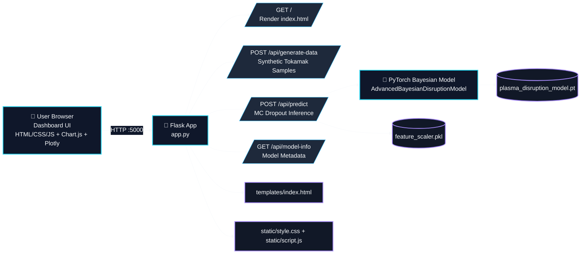
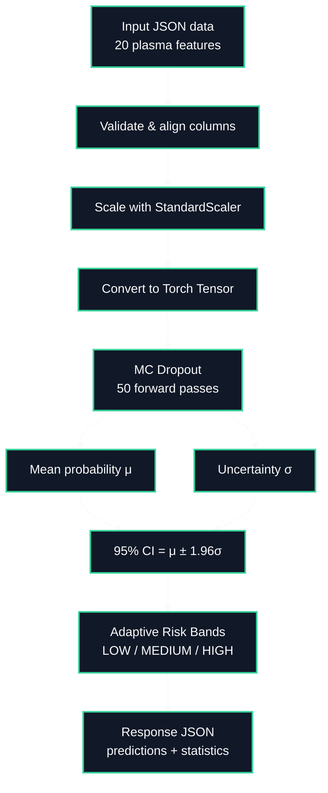
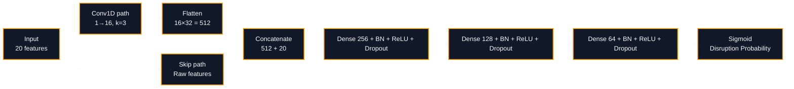
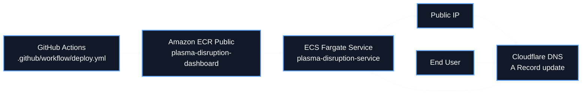

# 🏗️ ARCHITECTURE — Plasma Disruption Detection Dashboard

This document presents the end-to-end architecture of the application, including frontend, backend APIs, ML inference pipeline, and cloud deployment.

---

## 1) High-Level System Architecture

---

## 2) Inference & Uncertainty Flow

---

## 3) Model Architecture (Conceptual)

---

## 4) Deployment Architecture (AWS)

---

## 5) Runtime Components

- **Frontend**: Dashboard UI, controls, charts, tables
- **Backend**: Flask endpoints for generation, prediction, metadata
- **Model**: Bayesian NN with MC Dropout uncertainty
- **Artifacts**: model weights, scaler, feature schema
- **Container**: Dockerized Python app exposed on port `5000`
- **Cloud**: ECS Fargate deployment through GitHub Actions

---

## 6) Key File Mapping

- `app.py` → Flask API + model loading + inference logic
- `templates/index.html` → Dashboard markup
- `static/script.js` → Frontend behavior and API calls
- `static/style.css` → Dashboard styling
- `plasma_disruption_model.pt` → Trained model parameters
- `feature_scaler.pkl` → Input normalization
- `feature_columns.pkl` → Ordered feature schema
- `Dockerfile` → Multi-stage CPU-only container build
- `.github/workflow/deploy.yml` → CI/CD to ECR + ECS + DNS

---

If your markdown viewer does not render Mermaid, use GitHub web view for best display quality and contrast.
